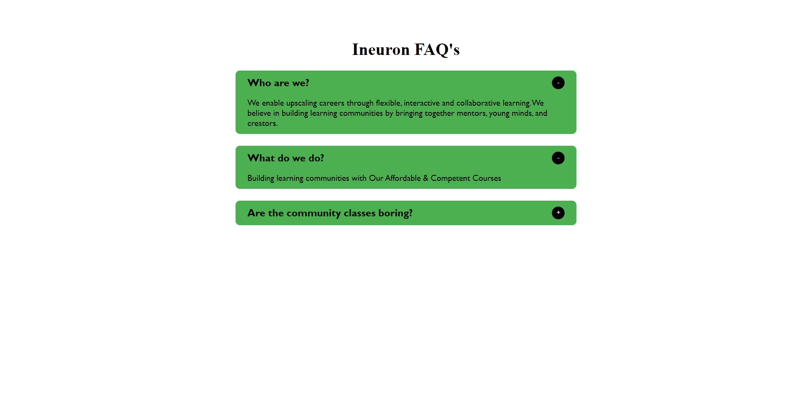

# Description
This is a simple project which is very common on websites, An Accordin is a very common feature of any Web Site.
## Time Taken

4 hours approximately

## Things Learned

- Parent Child nodes in HTML

[Live Demo](https://countdowntimer-akj.netlify.app/)

### SnapShot of the program

